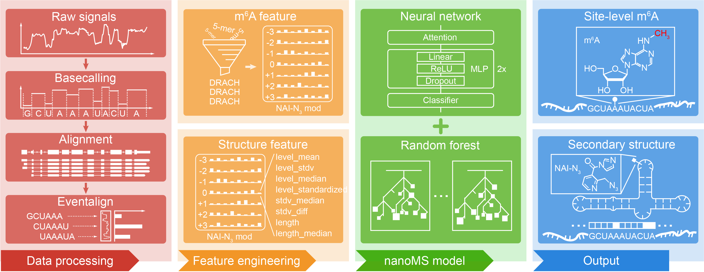

# nanoMS
Simultaneous detection of RNA m6A and structure from direct RNA-seq data.



## Installation
The installation process requires `Perl` and `Conda`, so you need to install them.

### Create Environment with Conda
First, download the repository and create the environment. Some dependencies related to the R language in yml may fail to download. If you encounter this issue, please try again a few times.

```
git clone https://github.com/cqz7633/FIAAU.git
cd ./FIAAU/install
conda env create -f environment.yml
```

Then, activate the `FIAAU` environment.

```
conda activate FIAAU
```
*NOTE:* Please ensure that your R is calling in the FIAAU environment.

### Install Perl package and local R package
We have compiled a simple installation bash script, please run it directly.

```
bash install.sh
```

## Prepare annotation files and samples information files

### 1. Mouse annotation(mm10) of methods

We provide annotation files for the 3'UTR of mouse mm10 required for APAtrap, CSI-UTR, DaPars, diffUTR, LABRAT, and QAPA. This annotation is based on the integration of GENCODE and PolyA_DB3 databases and can be downloaded from [Google Drive](https://drive.google.com/file/d/1ki3yKC0YcGy36pWV0XFleV3_Za3rh7aQ/view?usp=drive_link).
After downloading and decompressing, move the `mm10` directory to the `/FIAAU/anno`. The file structure is provided as below:
```
FIAAU/  
└── anno  
   └── mm10  
       ├── apatrap_3utr.bed  
       ├── apatrap_anno.bed  
       ├── csi_anno.bed  
       ├── csi.bed  
       ├── dapars_anno.bed  
       ├── diffutr_anno.bed  
       ├── labrat_anno.addhead.gff3  
       ├── labrat_anno.addhead.gff3.db  
       ├── mm10.chrom.sizes  
       ├── mm10.fa  
       ├── mm10.fa.fai  
       ├── qapa_anno.bed  
       ├── qapa_ident.txt  
       └── TFseqs.fasta
```

### 2. Samples information files

The pipeline requires `FastQ` and `BAM` files as inputs, so we need to create two separate files to provide their locations and corresponding sample information. Please note that the sample information file does not require a header.

#### FastQ information file
The sample file of FastQ, the first column is the absolute path of the FastQ file. If it is `pair-end` data, the `R1` and `R2` files of each sample are arranged together. The second column is sample information, used to provide control and treatment group information in the FastQ files.

The FastQ sample file is provided as below:

| column1| column2 |
|--------|---------|
| /PATH/control_rep1_R1.fq.gz | control |
| /PATH/control_rep1_R2.fq.gz | control |
| /PATH/control_rep2_R1.fq.gz | control |
| /PATH/control_rep2_R2.fq.gz | control |
| /PATH/treatment_rep1_R1.fq.gz | treatment |
| /PATH/treatment_rep1_R2.fq.gz | treatment |
| /PATH/treatment_rep2_R1.fq.gz | treatment |
| /PATH/treatment_rep2_R2.fq.gz | treatment |

#### BAM information file
The sample file of FastQ, the first column is the absolute path of the BAM file. The second column is sample information, used to provide control and treatment group information in the BAM files.

The BAM sample file is provided as below:

| column1| column2 |
|--------|---------|
| /PATH/control_rep1.bam| control |
| /PATH/control_rep2.bam | control |
| /PATH/treatment_rep1.bam | treatment |
| /PATH/treatment_rep2.bam | treatment |

## Run FIAAU pipline

FIAAU consists of two parts, one for running six methods and the other for integrating the results of the six methods. Please do not change the structure of the original FIAAU directory.

### 6 methods process

The operation of six methods is controlled by a Python script, with each method generating a Bash script and running simultaneously.  

The parameters of the `FIAAU_process.py` script is provided as below:

```
usage: FIAAU_process.py [-h] [-f F] [-b B] [-c C] [-t T] [-p P] [-m M] [-r R] [-o O] [-l L] [-bs BS] [-ct CT]

optional arguments:
  -h, --help  show this help message and exit
  -f F        absolute paths of fastq information file
  -b B        absolute paths of bam information file
  -c C        control
  -t T        treatment
  -p P        paired or single ('y' or 'n') default: y
  -m M        core numbers default: 4
  -r R        reads length  default: 150
  -o O        out put dir  default: ./FIAAU_Y-m-d_H-M-S
  -l L        run the step 'makeTFfasta' of LABRAT or not ('y' or 'n') default: n
  -bs BS      bin size for calculating big wig file default: 10
  -ct CT      coverage cut off default: 0.5
```
An example of running a command is provided as below:

```
python FIAAU_process.py -f /PATH/FastQ_info.txt -b /PATH/Bam_info.txt -c control -t treatment -o /PATH/output/
```

### Integration results process

The integration process is controlled by an R script, which will generate the FIAAU_integate directory under the output parameter directory of FIAAU_process.py and save the results here. Please be careful not to change the structure of the six method directories and the names of the result files in the FIAAU process output directory. The integration section will read them in a relatively fixed path. 

The parameters of the `FIAAU_integrate.R` script is provided as below:
```
Usage: FIAAU_integrate.R [-[-help|h]] [-[-fiaau_dir|f] <character>] [-[-control|c] <character>] [-[-treatment|t] <character>] [-[-over_num|n] [<integer>]] [-[-qapa_cut|q] [<double>]] [-[-p_met|pm] [<double>]] [-[-p_int|pi] [<double>]]
    -h|--help         help
    -f|--fiaau_dir    FIAAU dir, the output dir for FIAAU_process.py
    -c|--control      control name
    -t|--treatment    treatment name
    -n|--over_num     method overlap number, default: 2
    -q|--qapa_cut     QAPA diff cutoff, default: 20
    -pm|--p_met        p value cutoff of each method, default: 0.05
    -pi|--p_int        p_integrate cutoff, default: 0.05
```
An example of running a command is provided as below:

```
Rscript FIAAU_integrate.R -f /PATH/FIAAU_process_output_dir -c control -t treatment
```
