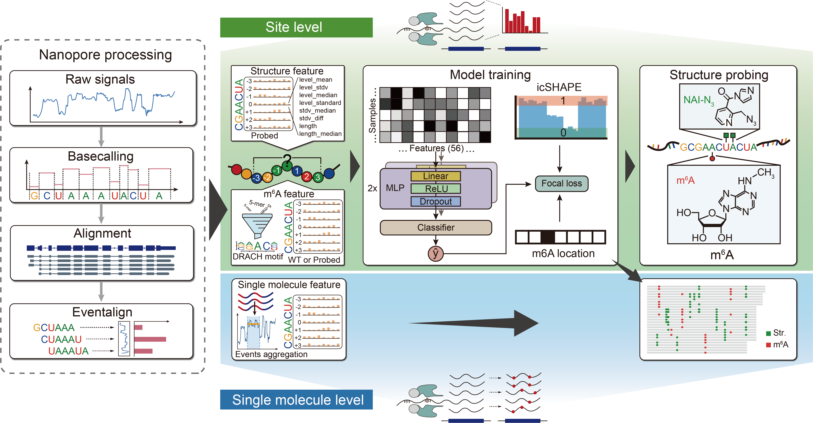
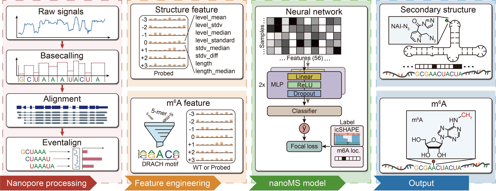

<p align="center"></p>

******************

# nanoMS

Detecting RNA structural probing signals and m6A from nanopore direct RNA sequencing data using deep learning.
<p align="center"></p>

# Create Environment with Conda

Although Guppy is no longer officially supported, we provide the source code package to facilitate installation. It can be downloaded from [Google Drive](https://drive.google.com/file/d/10Jr7VPfkcAqDZg4AE4a4yRtqq13DMU3t/view?usp=drive_link) (v6.1.3).

## Option 1. Install the environment via the YAML file
First, download the repository and create the environment.

```
git clone https://github.com/cqz7633/nanoMS.git
cd ./nanoMS
conda env create -f environment.withapp.yml
```
*NOTE:* The YAML file provides a pre-configured Python 3.8 environment, including PyTorch 2.4.1, CUDA 12.1, and cuDNN 9.1.0.

Then, activate the `nanoMS` environment.

```
conda activate nanoMS
```

## Option 2.  Install the environment manually using conda install
Create and activate a conda environment with Python 3.8:
```
conda create -n nanoMS python=3.8
conda activate nanoMS
```

Install the Python packages required for the nanoMS scripts and model using the following command:
```
conda install pandas numpy tqdm psutil scikit-learn pytorch -c conda-forge
```

*NOTE:* If you require GPU acceleration, please manually install the version of PyTorch that is compatible with your GPU drivers.

Install the application for Nanopore direct RNA sequencing data processing using the following command:
```
conda install bioconda::nanopolish
conda install bioconda::minimap2
conda install bioconda::samtools
```

# Nanopore direct RNA sequencing data processing

## 1. Basecalling
`Guppy` performs data trimming, filtering and basecalling, using FAST5 format files as input.

Example command:
```
guppy_basecaller --num_callers 4 -i /PATH/to/FAST5_dir/ -s /PATH/to/output --flowcell {flowcell_type} --kit {kit_type} --recursive --fast5_out
```

*NOTE:* The `--fast5_out` parameter is only applicable to older versions of `Guppy`. If your version does not support it, you can omit this parameter, but ensure that the `Guppy` workspace directory is set to the location of your FAST5 files for subsequent steps.

## 2. Merge Fastq
Merge the Fastq files obtained from basecalling..

Example command:
```
find /{guppy_dir}/pass/ -name "*fastq" -print0 | xargs -0 cat > /PATH/to/merge/fastq
```

## 3. Align Fastq files to the reference genome (transcript Fasta).
Align the merged Fastq files to the reference transcriptome.

Example command:
```
minimap2 -t 4 -ax map-ont -uf --secondary=no /PATH/to/transcript/fasta /PATH/to/merge/fastq > /PATH/to/sam
```

## 4. Convert Sam to Bam
Convert Sam format to Bam format and create an index for the Bam file.

Example command:
```
samtools view -hbS -@ 4 /PATH/to/sam | samtools sort -@ 4 -o /PATH/to/bam -
samtools index -@ 4 /PATH/to/bam
```

## 5. Create an index for Nanopolish
Convert Sam format to Bam format and create an index for the Bam file.

Example command:
```
nanopolish index --directory=/PATH/to/guppy/workspace --sequencing-summary=/PATH/to/guppy/sequencing_summary.txt /PATH/to/merge/fastq
```

## 6. Align nanopore current signals to reference k-mers
The nanopolish eventalign module aligns raw nanopore signal events to a reference genome.

Example command:
```
nanopolish eventalign -t 4 --signal-index --print-read-names --reads /PATH/to/merged/fastq --bam /PATH/to/bam --genome /PATH/to/transcript/fasta --summary /PATH/to/nanopolish/summary --scale-events > /PATH/to/events/align
```

# nanoMS inference

We have provided the trained model files in [Google Drive](https://drive.google.com/file/d/1df0hfNrswznawdOKMCfggHB0qxFz5rAH/view?usp=drive_link).
```
models/
 ├── structure # Trained model for structural modification
 └── m6A # Trained model for m6A
```

We have provided demo data in the `./Data`.
```
nanoMS/
└── data/
    ├── Demo_H9_nanopolish_events.tsv # events data after nanopolish eventalign
    ├── Demo_H9_ref_m6A.tsv # m6A position reference
    └── Demo_H9_shape.tsv # icSHAPE data
```

## Site level
### 1. Clean events

Clean the current information file obtained from nanopolish using the `clean_event.py` script

The parameters of the `clean_event.py` script is provided as below:
```
usage: clean_event.py [-h] -i INPUT -o OUTPUT [-p PROCESSES] [-c CHUNK_SIZE]

Merge entries at the same location and perform data cleaning.

optional arguments:
  -h, --help            show this help message and exit
  -i INPUT, --input INPUT
                        Input data file path.
  -o OUTPUT, --output OUTPUT
                        Output result file path.
  -p PROCESSES, --processes PROCESSES
                        Number of processes used.
  -c CHUNK_SIZE, --chunk_size CHUNK_SIZE
                        chunk size
```
Example command:
```
python ./scripts/clean_event.py -i ./data/Demo_H9_nanopolish_events.tsv -o /PATH/to/clean_events.txt -p 4
```
Path to the result file example: ./file_example/site/Demo_H9_nanopolish_events.clean.tsv

### 2. Generate inference data

Generate structure and m6A inference data using the `generate_infer_data.py` script.

The parameters of the `generate_infer_data.py` script is provided as below:
```
usage: generate_infer_data.py [-h] -i INPUT_FILE -o OUTPUT_DIR -f FILE_PREFIX [-p PROCESSES]
                              [-m {both,m6a,structure}]

Generate m6A sites and secondary structure data for inference at the site level.

optional arguments:
  -h, --help            show this help message and exit
  -i INPUT_FILE, --input_file INPUT_FILE
                        Input file after clean_event.py process
  -o OUTPUT_DIR, --output_dir OUTPUT_DIR
                        Output dir path
  -f FILE_PREFIX, --file_prefix FILE_PREFIX
                        Output file prefix
  -p PROCESSES, --processes PROCESSES
                        Number of processes to use (default: 4)
  -m {both,m6a,structure}, --mode {both,m6a,structure}
                        Choose outputs: 'both' (default), 'm6a' (only m6a sites), 'structure' (only structure)
```
Example command:
```
python ./scripts/generate_infer_data.py -p 4 -i /PATH/to/clean_events.txt -o /PATH/to/output/dir -f Demo_prefix -m both
```
Path to the result file example:  
./file_example/site/infer/Demo_H9_nanopolish_events.infer.m6a.tsv
./file_example/site/infer/Demo_H9_nanopolish_events.infer.structure.tsv

### 3. nanoMS inference at site level

Perform inference using the trained nanoMS model using `nanoMS_infer.py` script. 

The parameters of the `nanoMS_infer.py` script is provided as below:
```
usage: nanoMS_infer.py [-h] --test_file TEST_FILE --model_dir MODEL_DIR
                       [--preprocessed_train_data_file PREPROCESSED_TRAIN_DATA_FILE] --output_file
                       OUTPUT_FILE [--gpu_id GPU_ID]

nanoMS predictor

optional arguments:
  -h, --help            show this help message and exit
  --test_file TEST_FILE
                        The input file path
  --model_dir MODEL_DIR
                        Output directory for nanoMS training
  --preprocessed_train_data_file PREPROCESSED_TRAIN_DATA_FILE
                        Pre processed training data save/load file name
  --output_file OUTPUT_FILE
                        Path of output results
  --gpu_id GPU_ID       Comma-separated list of GPU IDs to use (e.g., "0,1,2"). If not specified, CPU will be
                        used.
```

The following command is an example of structural modification prediction:
```
python ./nanoMS_infer.py --model_dir /PATH/to/models/strcuture --test_file /PATH/to/structure/inference/data --output_file /PATH/to/output
```

The following command is an example of m6A prediction:
```
python ./nanoMS_infer.py --model_dir /PATH/to/models/m6A --test_file /PATH/to/m6A/inference/data --output_file /PATH/to/output
```

Output format is as follows:
| contig | position | NeuralNetwork_Prob |
|--------|---------|---------|
| ENST00000416718.2 | 82 | 0.86 |
| ENST00000416718.2 | 145 | 0.57 |
| ENST00000416718.2 | 157 | 0.41 |
| ENST00000327044.7 | 1335 | 0.43 |
| ENST00000477976.5 | 2766 | 0.21 |
| ENST00000379370.7 | 6241 | 0.48 |

## Single-molecule level
### 1. Clean events

Clean the current information file obtained from nanopolish using the `clean_event.sm.py` script

The parameters of the `clean_event.sm.py` script is provided as below:
```
usage: clean_event.sm.py [-h] -i INPUT -o OUTPUT [-p PROCESSES] [-c CHUNK_SIZE]

Merge entries at the single-molecule level and perform data cleaning.

optional arguments:
  -h, --help            show this help message and exit
  -i INPUT, --input INPUT
                        Input data file path.
  -o OUTPUT, --output OUTPUT
                        Output result file path.
  -p PROCESSES, --processes PROCESSES
                        Number of processes used.
  -c CHUNK_SIZE, --chunk_size CHUNK_SIZE
                        Number of rows per chunk
```
Example command:
```
python ./scripts/clean_event.sm.py -i ./data/Demo_H9_nanopolish_events.tsv -o /PATH/to/Single-molecule/clean_events.txt -p 4
```

Path to the result file example: ./file_example/sinlge_molecule/Demo_H9_nanopolish_events.sm.clean.tsv


### 2. Generate single-molecule level inference data
### For structural modification
Generate structure inference data using the `generate_struct_infer.sm.py` script.

The parameters of the `generate_struct_infer.sm.py` script is provided as below:
```
usage: generate_struct_infer.sm.py [-h] -i INPUT -o OUTPUT [-p PROCESSES]

Extract context features of the m6A-associated DRACH motif at the single-molecule level for subsequent inference.

optional arguments:
  -h, --help            show this help message and exit
  -i INPUT, --input INPUT
                        Input file path
  -o OUTPUT, --output OUTPUT
                        Output file path
  -p PROCESSES, --processes PROCESSES
                        Number of parallel processes
```
Example command:
```
python ./scripts/generate_struct_infer.sm.py -p 4 -i /PATH/to/Single-molecule/clean_events.txt -o /PATH/to/output
```

Path to the result file example: ./file_example/sinlge_molecule/Demo_H9_nanopolish_events.sm.infer.structure.tsv

### For m6A
Generate structure inference data using the `generate_m6a_infer.sm.py` script.

The parameters of the `generate_m6a_infer.sm.py` script is provided as below:
```
usage: generate_m6a_infer.sm.py [-h] -i INPUT -o OUTPUT [-p PROCESSES]

Extract context features of the m6A-associated DRACH motif at the single-molecule level for subsequent inference.

optional arguments:
  -h, --help            show this help message and exit
  -i INPUT, --input INPUT
                        Input file path
  -o OUTPUT, --output OUTPUT
                        Output file path
  -p PROCESSES, --processes PROCESSES
                        Number of parallel processes (default: 4)
```
Example command:
```
python ./scripts/generate_m6a_infer.sm.py -p 4 -i /PATH/to/Single-molecule/clean_events.txt -o /PATH/to/output
```

Path to the result file example: ./file_example/sinlge_molecule/Demo_H9_nanopolish_events.sm.infer.m6a.tsv

### 3. nanoMS inference at single-molecule
Perform inference using the trained nanoMS model using `nanoMS_infer.sm.py` script. 

The parameters of the `nanoMS_infer.sm.py` script is provided as below:
```
usage: nanoMS_infer.sm.py [-h] --test_file TEST_FILE --model_dir MODEL_DIR
                          [--preprocessed_train_data_file PREPROCESSED_TRAIN_DATA_FILE] --output_file OUTPUT_FILE
                          [--gpu_id GPU_ID]

nanoMS single-molecule predictor

optional arguments:
  -h, --help            show this help message and exit
  --test_file TEST_FILE
                        The input file path
  --model_dir MODEL_DIR
                        Output directory for nanoMS training
  --preprocessed_train_data_file PREPROCESSED_TRAIN_DATA_FILE
                        Pre processed training data save/load file name
  --output_file OUTPUT_FILE
                        Path of output results
  --gpu_id GPU_ID       Comma-separated list of GPU IDs to use (e.g., "0,1,2"). If not specified, CPU will be used.
```

The following command is an example of structural modification prediction:
```
python ./nanoMS_infer.sm.py --model_dir /PATH/to/models/strcuture --test_file /PATH/to/Single-molecule/structure/inference/data --output_file /PATH/to/output
```

The following command is an example of m6A prediction:
```
python ./nanoMS_infer.sm.py --model_dir /PATH/to/models/m6A --test_file /PATH/to/Single-molecule/m6A/inference/data --output_file /PATH/to/output
```

Output format is as follows:
| contig | position | read_name | NeuralNetwork_Prob |
|--------|---------|---------|---------|
| ENST00000416718.2 | 82 | read_name1 | 0.86 |
| ENST00000416718.2 | 82 | read_name2 | 0.57 |
| ENST00000416718.2 | 82 | read_name3 | 0.41 |
| ENST00000327044.7 | 1335 | read_name4 | 0.43 |
| ENST00000327044.7 | 1336 | read_name4 | 0.85 |
| ENST00000477976.5 | 2766 | read_name5 | 0.21 |
| ENST00000379370.7 | 6241 | read_name6 | 0.48 |

# Retrain nanoMS on your own data.

## 1. Clean events

Clean the current information file obtained from nanopolish using the `clean_event.py` script

The parameters of the `clean_event.py` script is provided as below:
```
usage: clean_event.py [-h] -i INPUT -o OUTPUT [-p PROCESSES] [-c CHUNK_SIZE]

Merge entries at the same location and perform data cleaning.

optional arguments:
  -h, --help            show this help message and exit
  -i INPUT, --input INPUT
                        Input data file path.
  -o OUTPUT, --output OUTPUT
                        Output result file path.
  -p PROCESSES, --processes PROCESSES
                        Number of processes used.
  -c CHUNK_SIZE, --chunk_size CHUNK_SIZE
                        chunk size
```
Example command:
```
python ./scripts/clean_event.py -i ./data/Demo_H9_nanopolish_events.tsv -o /PATH/to/clean_events.txt -p 4
```

Path to the result file example: ./file_example/site/Demo_H9_nanopolish_events.clean.tsv

## 2. Generate training data

### For structure

Prepare a file containing known RNA secondary structures as training labels. Here, we use icSHAPE data, where the first column is the transcript name, the second column is the transcript length, the third column is ‘*’, and each subsequent column represents the pairing score for each position in the transcript. 

The format is as follows:
| Trans| Length | * | Pos1 | Pos2 | Pos3 | Pos4 | ... |
|--------|---------|---------|---------|---------|---------|---------|---------|
| ENST00000574232.5 | 2129 | * | 0.189 | 0.529 | 0.043 | 0.087 | ... |
| ENST00000576646.7 | 629 | * | 0.176 | 0.347 | 0.347 | 0.871 | ... |
| ENST00000592202.5 | 1469 | * | 0.445 | 0.012 | 0.312 | 0.546 | ... |

*NOTE:* This file does not contains a header and is divided by tabs.

Generate training data from cleaned event data using the `generate_struct_train.py` script.

The parameters of the `generate_struct_train.py` script is provided as below:
```
usage: generate_struct_train.py [-h] -i INPUT_FILE -o OUTPUT_FILE -r REF_SHAPE_FILE [-p PROCESSES]

Extract context features of the structural modification at the site level for training.

optional arguments:
  -h, --help            show this help message and exit
  -i INPUT_FILE, --input_file INPUT_FILE
                        Input file after clean_event.py process
  -o OUTPUT_FILE, --output_file OUTPUT_FILE
                        Output file path
  -r REF_SHAPE_FILE, --ref_shape_file REF_SHAPE_FILE
                        Reference icshape file
  -p PROCESSES, --processes PROCESSES
                        Number of parallel processes (default: 4)
```
Example command:
```
python ./scripts/generate_m6a_train.py -p 4 -i /PATH/to/clean_events.txt -o /PATH/to/struct_train_data.tsv -r ./data/Demo_H9_shape.tsv
```

Path to the result file example: ./file_example/site/train/Demo_H9_nanopolish_events.train.structure.tsv

### For m6A
Prepare a file containing known m6A sites as training labels, where the first column is the transcript name and the second column is the relative position of the m6A site within the transcript.

The format is as follows:
| Trans| Position |
|--------|---------|
| ENST00000416718.2 | 82 |
| ENST00000416718.2 | 145 |
| ENST00000416718.2 | 157 |
| ENST00000327044.7 | 1335 |
| ENST00000477976.5 | 2766 |
| ENST00000379370.7 | 6241 |

*NOTE:* This file contains a header and is divided by tabs.

Generate training data from cleaned event data using the `generate_m6a_train.py` script.

The parameters of the `generate_m6a_train.py` script is provided as below:
```
usage: generate_m6a_train.py [-h] -i INPUT_FILE -o OUTPUT_FILE -r REF_POS_FILE [-b {0,1}] [-p PROCESSES]

Extract context features of the m6A-associated DRACH motif at the site level for training.

optional arguments:
  -h, --help            show this help message and exit
  -i INPUT_FILE, --input_file INPUT_FILE
                        Input clean_event.py file
  -o OUTPUT_FILE, --output_file OUTPUT_FILE
                        Output file path
  -r REF_POS_FILE, --ref_pos_file REF_POS_FILE
                        Reference position file
  -b {0,1}, --base {0,1}
                        Label base type: 0 for 0-base, 1 for 1-base
  -p PROCESSES, --processes PROCESSES
                        Number of parallel processes (default: 4)
```
Example command:
```
python ./scripts/generate_m6a_train.py -p 5 -i /PATH/to/clean_events.txt -o /PATH/to/m6A_train_data.tsv -r ./data/Demo_H9_ref_position.tsv -b 0
```

Path to the result file example: ./file_example/site/train/Demo_H9_nanopolish_events.train.m6a.tsv

## 3. nanoMS training

Train the nanoMS model using the `nanoMS_train.py script`, which accepts either structure data or m6A data as input. 

The parameters for nanoMS_train.py are as follows:
```
usage: nanoMS_train.py [-h] --train_file TRAIN_FILE [--valid_ratio VALID_RATIO] [--valid_file VALID_FILE]
                       --output_dir OUTPUT_DIR [--ncol NCOL] [--epochs EPOCHS] [--batch_size BATCH_SIZE]
                       [--learning_rate LEARNING_RATE] [--weight_decay WEIGHT_DECAY] [--patience PATIENCE]
                       [--seed SEED] [--dropout_rate DROPOUT_RATE] [--focal_alpha FOCAL_ALPHA]
                       [--focal_gamma FOCAL_GAMMA] [--gpu_id GPU_ID]
                       [--preprocessed_train_data_file PREPROCESSED_TRAIN_DATA_FILE]
                       [--preprocessed_test_data_file PREPROCESSED_TEST_DATA_FILE] [--save_epoch_model] [--l2 L2]
                       [--hidden_layers HIDDEN_LAYERS [HIDDEN_LAYERS ...]] [--use_preprocessed]

Training a Neural Network to Predict RNA Structural Modifications and m6A Sites from Nanopore Sequencing Data

optional arguments:
  -h, --help            show this help message and exit
  --train_file TRAIN_FILE
                        Training data file path.
  --valid_ratio VALID_RATIO
                        Validation set ratio. default (0.2)
  --valid_file VALID_FILE
                        Validation data file path. If no file is provided, it will be split from the training file
                        according to the ratio set by --valid_ratio.
  --output_dir OUTPUT_DIR
                        Directory to save model and results.
  --ncol NCOL           Number of data columns
  --epochs EPOCHS       Number of training epochs.
  --batch_size BATCH_SIZE
                        Training batch size.
  --learning_rate LEARNING_RATE
                        Optimizer learning rate.
  --weight_decay WEIGHT_DECAY
                        Weight decay (L2 regularization).
  --patience PATIENCE   Patience counter for early stopping.
  --seed SEED           Random seed.
  --dropout_rate DROPOUT_RATE
                        Dropout rate for regularization.
  --focal_alpha FOCAL_ALPHA
                        Alpha parameter for focal loss.
  --focal_gamma FOCAL_GAMMA
                        Gamma parameter for focal loss.
  --gpu_id GPU_ID       Comma-separated list of GPU IDs to use (e.g., "0,1,2"). If not specified, CPU will be used.
  --preprocessed_train_data_file PREPROCESSED_TRAIN_DATA_FILE
                        Path to save/load preprocessed training data.
  --preprocessed_test_data_file PREPROCESSED_TEST_DATA_FILE
                        Path to save/load preprocessed testing data.
  --save_epoch_model    Save the model for each epoch
  --l2 L2               L2 regularization (weight_decay).
  --hidden_layers HIDDEN_LAYERS [HIDDEN_LAYERS ...]
                        List of neural network hidden layer sizes. e.g., --hidden_layers 256 128
  --use_preprocessed    Whether to use preprocessed data files.
```
Example command:
```
python ./nanoMS_train.py \
	--batch_size 32 \
	--train_file /PATH/to/m6a/or/structure/train/data \
	--epochs 150 \
	--seed 43 \
	--patience 15 \
	--dropout_rate 0.5 \
	--gpu_id 0 \
	--output_dir /PATH/to/output/dir 
```
